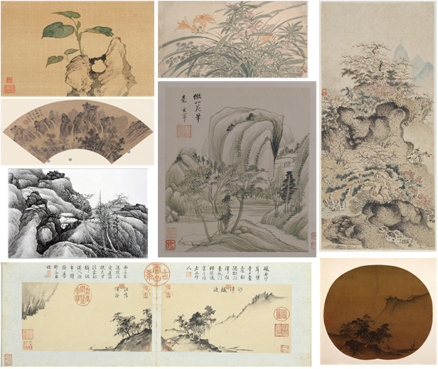

# CPSD 中国画派数据集

<strong>数据集下载地址: 
 
https://www.dropbox.com/scl/fo/orfr9p2ymm1qxjv740yvx/AC11ZhpDDzUOeM0u6ad6Wp0?rlkey=55zlm50cy77lr2b7jmnxba33v&st=q6ogqpn3&dl=0

本数据集的构建是基于周积寅先生的中国画派论。根据周先生的理论，本数据集共分为18个类别，主要包括：
The construction of this dataset is based on Mr. Zhou Jiyin's theory of Chinese painting schools. According to Mr. Zhou's theory, this dataset is divided into 18 categories, mainly including:

1. 浙江画派（Zhejiang)
2. 吴派(Wu)
3. 松江画派(SongJiang)
4. 武林画派(WuLin)
5. 波臣画派(BoChen)
6. 姑熟画派(GuShu)
7. 新安画派(XinAn)
8. 金陵积墨画派(JinLingJiMo)
9. 娄东画派(LouDong)
10. 虞山画派(YuShan)
11. 常州画派(ChangZhou)
12. 指头画派(ZhiTou)
13. 界画派(Jie)
14. 南蘋画派(NanPin)
15. 兰竹石画派(LanZhuShi)
16. 京江画派(JingJiang)
17. 上海画派(ShangHai)
18. 岭南画派(LingNan)

数据据的来源主要包括三个方面：1）台北故宫博物院公开的数据集；2）自行拍摄整理；3）互联网搜集。由于在本数据集构建的过程中有一个重要的原则——非高清数据不考虑。这也导致了目前数据量并不是特别多，大概有3000张左右的图片。但数据的平均分辨率却非常高，为3648 x 3298。而且，数据集包含的画作种类多样。此外，每张数据标注了所述的画派类别及作者信息。部分数据如下图所示。
The sources of the data mainly include three aspects: 1) The publicly available dataset from the Taipei National Palace Museum; 2) Self-collected and organized photographs; 3) Data collected from the internet. An important principle during the construction of this dataset was that non-high-definition data would not be considered. This has resulted in a dataset that is not particularly large, with approximately 3,000 images. However, the average resolution of the data is very high, at 3648 x 3298. Additionally, the dataset contains a diverse range of artworks. Each image is labeled with the corresponding painting school and author information. Some sample data is shown below.

本数据集所列出的所有画派及其代表人物具体如下图所示。
The list of all painting schools and their representative figures in this dataset is shown in the figure below.

